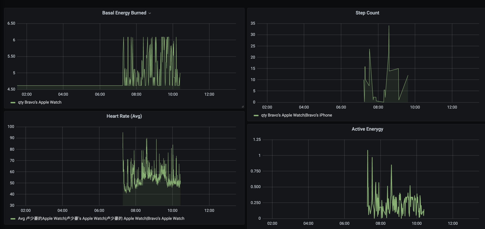

# Apple Health Monitor 

* Use grafana to display the health data from apple devices.



## requirements 

* Auto Export (An apple app)
* python
* flask
* influxdb
* uwsgi
* grafana

## Installation

```shell
$ pip3 install -r requirements.txt  # 1. install python dependencies.
$ python3 app.py # for development environment.
$ uwsgi --ini uwsgi.ini  # for production environment.
```

## Systemd to start (optional)

* configure config file.

```init
# /etc/systemd/sytem/uwsgi.service
[Unit]
Description=uWSGI instance to serve your_app
After=network.target

[Service]
ExecStart=${EXE_BIN} --ini ${CONFIG_PATH}
Restart=always
KillSignal=SIGQUIT
Type=notify
StandardError=syslog
NotifyAccess=all

[Install]
WantedBy=multi-user.target
```

* start service

```
$ systemctl enable uwsgi
$ systemctl daemon-reload
$ systemctl start uwsgi
```